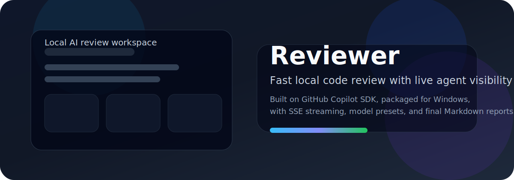

# Reviewer

Reviewer 是一個建立在 [GitHub Copilot SDK](https://github.com/github/copilot-sdk) 之上的本機程式碼審查工具。它維持現有的多代理 review 流程、HTTP/SSE 契約與打包方式，但把產品表面收斂成更中性的本機 Reviewer 形態。



## 核心能力

- Windows 單一執行檔 `Reviewer.exe`
- 啟動後自動開本機 FastAPI 與瀏覽器 UI
- 支援 `folder`、`files`、`uploaded_files` 三種輸入模式
- 支援 `focus prompt`
- 支援模型 preset 與 per-role override
- 支援 SSE 串流、tool call、token/context metrics
- 一般模式保留 `Orchestrator -> 3 reviewers -> Synthesizer`
- 嚴格模式保留結構化 findings、verification 與 verdict
- 最終報告可直接複製或下載 Markdown / JSON

## 使用方式

### 發佈版

1. 雙擊 `Reviewer.exe`
2. 程式會自動選擇可用 port、啟動本機服務、開啟預設瀏覽器
3. 在左側輸入資料夾、檔案清單，或直接拖放文字/程式碼檔
4. 視需要填入 `Focus Prompt`
5. 送出 review 並在畫面上即時查看各代理輸出與最終報告

### 開發版

先安裝依賴：

```powershell
uv sync --extra dev
cd src/frontend
npm install
```

啟動後端：

```powershell
cd src
uv run uvicorn backend.main:app --reload --port 8000
```

啟動前端：

```powershell
cd src/frontend
npm run dev
```

打開瀏覽器進入 `http://localhost:5173`。

## 打包

在 repo 根目錄執行：

```powershell
.\scripts\build-reviewer.ps1
```

完成後輸出：

```text
dist\Reviewer.exe
```

## 認證與設定

- 若使用 GitHub Copilot CLI，請先完成登入：

```powershell
copilot auth status
```

- 若要使用 BYOK，請把 `.env.example` 複製成 `.env` 並填入 provider 設定。
- 發佈版會以 `Reviewer.exe` 所在目錄作為工作目錄，因此 `.env` 需放在執行檔同層。

## Review 流程

- 一般模式：`Orchestrator` 先縮小範圍並建立 review plan，三個 reviewer 以不同視角平行審查，最後由 `Synthesizer` 彙整出最終報告
- 嚴格模式：先做 deterministic verification，再由多個 strict specialist 平行審查，必要時進入 `Challenger`，最後由 `Judge` 產出裁決與最終報告
- SSE 會即時推送 agent 狀態、tool call 與 metrics

## Agent 介紹

### 一般模式

- `Orchestrator` / 協調規劃：先建立專案結構地圖，挑出最 relevant 的檔案與焦點，讓三位 reviewer 針對同一批核心內容做獨立審查；在 `auto` preset 下也會順手建議各角色模型。
- `Reviewer 1` / 架構審查：從系統架構角度看 service boundary、資料流一致性、API 契約、擴充性、部署負擔與長期演進成本，適合抓「現在能跑，但之後會很痛」的設計問題。
- `Reviewer 2` / 後端審查：聚焦資料庫、快取、API 邊界、授權驗證、可靠性、可觀測性與後端效能，會特別指出真實失效模式，例如連線池耗盡、外部呼叫無 timeout、輸入邊界驗證缺漏。
- `Reviewer 3` / 前端與體驗審查：專看 a11y、i18n/l10n、互動流程、錯誤與 loading 狀態、元件架構、瀏覽器效能與版面正確性，把 UX regression 視為正式的產品故障來評估。
- `Synthesizer` / 最終報告整合：讀完三份獨立審查後做最後判斷，解決彼此衝突的意見，濃縮出真正要先處理的 3 到 5 個重點，避免只是機械式把三份內容拼起來。

### 嚴格模式

嚴格模式會先跑一段非 LLM 的 deterministic verification，從 CI、task runner、manifest、文件與可安全執行的檢查中整理證據，再交給下列 agent 使用。

- `Spec Drift` / 規格漂移：比對程式碼、測試、設定與文件是否一致，專抓需求漂移、規格失真、行為悄悄改變卻沒有同步更新文件或測試的問題。
- `Architecture Integrity` / 架構完整性：檢查模組責任、分層邊界、系統一致性與設計是否自洽，特別擅長抓過度設計、錯位抽象與架構說法跟實作不一致的地方。
- `Security Boundary` / 安全邊界：聚焦 trust boundary、auth/authz、secret handling、unsafe defaults 與 generated code 常見的安全假設落差，負責找出真正能變成漏洞的入口。
- `Runtime Operational` / 執行期與營運：檢查 build、CI、依賴真實性、錯誤處理、執行期假設與營運風險，尤其在乎 repo 是否真的有可重跑、可驗證的正式驗證入口。
- `Test Integrity` / 測試完整性：確認測試是否真的驗證產品行為，而不是只複製實作；也會看 coverage gap、integration label 是否名實相符，以及測試與規格之間是否脫節。
- `LLM Artifact Simplification` / LLM 產物與簡化：專抓 LLM repo 常見的過度抽象、假擴充性、重複樣板、幻覺 API、過多 indirection 與不必要複雜度。
- `Challenger` / 挑戰者：不新增問題，專門推翻、降級或要求重新審視證據薄弱、敘述過度或與 verification 衝突的 findings，避免 strict 模式把可疑訊號直接當定論。
- `Judge` / 最終裁決：綜合 specialists、challenge 結果與 verification summary，輸出最終 verdict、共識問題、爭議問題與正式報告，是 strict 模式的最後決策者。

## API 與文件

- OpenAPI: [docs/API_SPEC.yaml](./docs/API_SPEC.yaml)
- 事件格式: [docs/EVENT_SCHEMA.md](./docs/EVENT_SCHEMA.md)
- 架構說明: [docs/ARCHITECTURE.md](./docs/ARCHITECTURE.md)
- 機器整合: [docs/INTEGRATION_GUIDE.md](./docs/INTEGRATION_GUIDE.md)

## 授權

本專案保留原有授權條件，並持續標示其建立在 GitHub Copilot SDK 之上。
